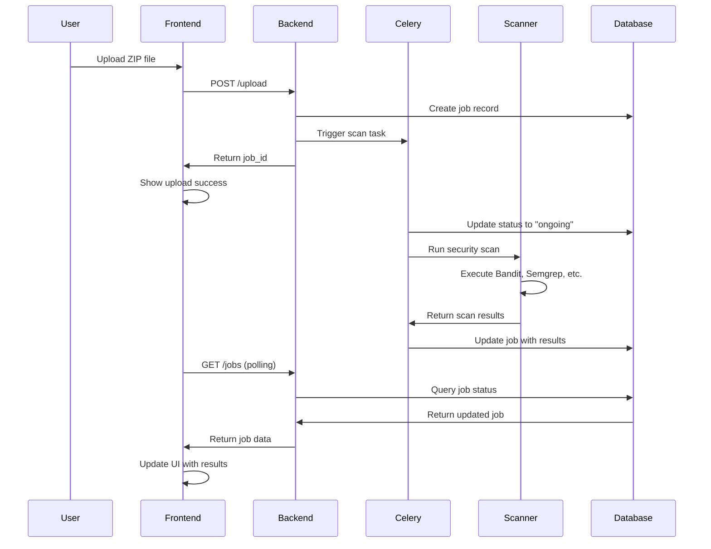
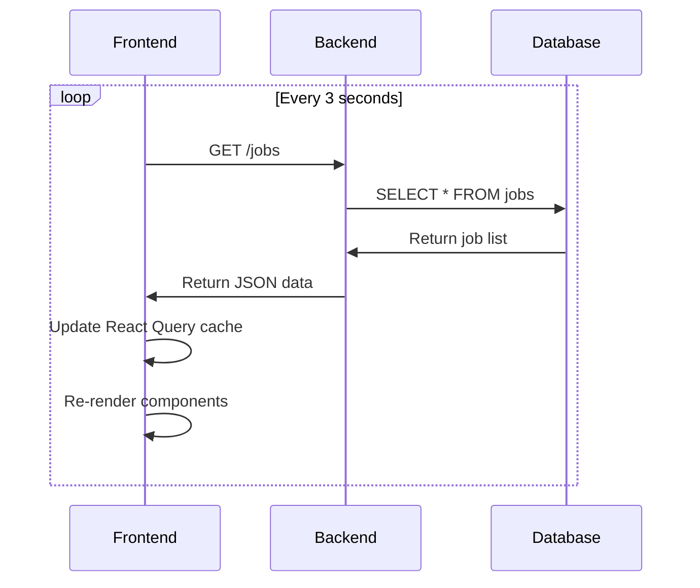
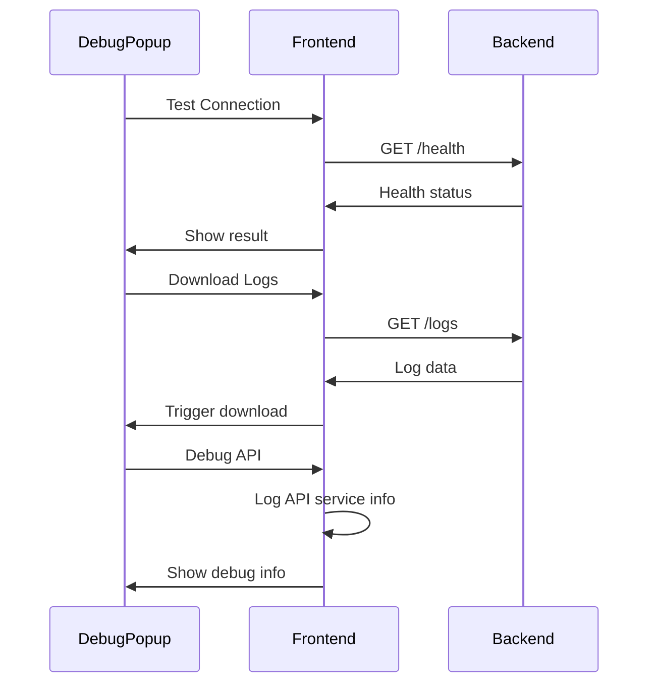

# DWAS Scanner - Frontend & Backend Architecture Documentation

## Table of Contents
1. [Overview](#overview)
2. [Part I: User-Friendly Guide](#part-i-user-friendly-guide)
3. [Part II: Developer Technical Guide](#part-ii-developer-technical-guide)
4. [API Endpoints Reference](#api-endpoints-reference)
5. [Component Architecture](#component-architecture)
6. [Data Flow Diagrams](#data-flow-diagrams)

---

## Overview

The DWAS (Django Web Application Security) Scanner is a comprehensive security analysis tool that combines a modern React frontend with a FastAPI backend to scan Django projects for security vulnerabilities. The system uses multiple security tools including Bandit, Semgrep, pip-audit, and Pylint to provide thorough security analysis.

---

## Part I: User-Friendly Guide

### What is DWAS Scanner?

DWAS Scanner is a web application that helps developers find security issues in their Django projects. Think of it as a security guard for your code that checks for common vulnerabilities and coding problems.

### How It Works (Simple Explanation)

1. **Upload Your Project**: You upload a ZIP file containing your Django project
2. **Automatic Scanning**: The system automatically runs multiple security checks
3. **View Results**: You get a detailed report showing any security issues found
4. **Take Action**: You can review and fix the issues to make your code more secure

### Main Features

- **Project Upload**: Drag and drop or click to upload Django project ZIP files
- **Real-time Monitoring**: Watch your scans progress in real-time
- **Detailed Reports**: Get comprehensive security analysis with specific recommendations
- **Multiple Security Tools**: Uses industry-standard tools like Bandit, Semgrep, and pip-audit
- **Clean Interface**: Modern, professional design that's easy to use

### User Interface Components

#### Dashboard Page
- **Upload Zone**: Where you upload your Django project files
- **Scan History**: List of all your previous scans with their status
- **Search & Filter**: Find specific scans quickly
- **Debug Tools**: Hidden debug menu for troubleshooting (bottom-right corner)

#### Scan Details Page
- **Overview**: Summary of the scan results
- **Security Issues**: Detailed list of vulnerabilities found
- **Code Quality**: Analysis of code structure and best practices
- **Dependencies**: Check for vulnerable packages in your project

#### Navigation
- **Header**: Main navigation with logo and theme toggle
- **Footer**: Additional information and links
- **Debug Popup**: Hidden tools for developers (bug icon in bottom-right)

---

## Part II: Developer Technical Guide

### System Architecture

The DWAS Scanner follows a modern microservices architecture with clear separation of concerns:

```
Frontend (React + TypeScript) ←→ Backend (FastAPI + Python) ←→ Security Tools
     ↓                              ↓                           ↓
  User Interface              API Endpoints              Bandit, Semgrep, etc.
```

### Frontend Architecture

#### Technology Stack
- **Framework**: React 18 with TypeScript
- **Build Tool**: Vite
- **UI Library**: Radix UI + Tailwind CSS
- **State Management**: TanStack Query (React Query)
- **Routing**: React Router v6
- **Icons**: Lucide React

#### Core Components

##### 1. App Component (`src/App.tsx`)
```typescript
// Main application wrapper with providers
const App = () => (
  <QueryClientProvider client={queryClient}>
    <ThemeProvider defaultTheme="light" storageKey="dwas-theme">
      <TooltipProvider>
        <Toaster />
        <Sonner />
        <BrowserRouter>
          <Routes>
            <Route path="/" element={<Navigate to="/dashboard" replace />} />
            <Route path="/dashboard" element={<Dashboard />} />
            <Route path="/scans/:jobId" element={<ScanDetails />} />
            <Route path="/settings" element={<Settings />} />
            <Route path="/help" element={<Help />} />
            <Route path="*" element={<NotFound />} />
          </Routes>
          <DebugPopup />
        </BrowserRouter>
      </TooltipProvider>
    </ThemeProvider>
  </QueryClientProvider>
);
```

**Purpose**: Application root with global providers and routing
**Backend Connection**: None directly, provides context for child components

##### 2. Dashboard Component (`src/pages/Dashboard.tsx`)
```typescript
// Main dashboard with upload and job management
export default function Dashboard() {
  const { 
    jobs, 
    isLoading, 
    error: jobsError,
    refetch,
    uploadJob, 
    deleteJob, 
    isUploading, 
    isDeleting,
    uploadError,
    deleteError 
  } = useJobs()

  // Automatic connection test on mount
  useEffect(() => {
    const testConnection = async () => {
      try {
        const health = await apiService.healthCheck()
        console.log('Backend connection successful:', health)
      } catch (error) {
        console.error('Backend connection failed:', error)
        toast({
          title: "Backend Connection Error",
          description: `Cannot connect to the backend server. Please ensure it's running on http://localhost:8000`,
          variant: "destructive",
        })
      }
    }
    testConnection()
  }, [toast])
```

**Purpose**: Main interface for uploading projects and managing scans
**Backend Connection**: 
- `GET /jobs` - Fetch all scan jobs
- `POST /upload` - Upload new project
- `DELETE /jobs/{job_id}` - Delete scan job
- `GET /health` - Health check

##### 3. ScanDetails Component (`src/pages/ScanDetails.tsx`)
```typescript
// Detailed view of individual scan results
export default function ScanDetails() {
  const { jobId } = useParams()
  const { 
    job, 
    isLoading, 
    deleteJob, 
    isDeleting,
    deleteError 
  } = useJob(jobId || "")
```

**Purpose**: Display detailed scan results and analysis
**Backend Connection**:
- `GET /jobs/{job_id}` - Fetch specific job details
- `DELETE /jobs/{job_id}` - Delete specific job

##### 4. DebugPopup Component (`src/components/DebugPopup.tsx`)
```typescript
// Debug tools popup menu
export function DebugPopup() {
  const handleTestConnection = async () => {
    try {
      const health = await apiService.healthCheck()
      toast({
        title: "Connection Test",
        description: `Backend is reachable: ${health.message}`,
      })
    } catch (error) {
      toast({
        title: "Connection Test Failed",
        description: `Cannot reach backend: ${error}`,
        variant: "destructive",
      })
    }
  }
```

**Purpose**: Developer tools for debugging and testing
**Backend Connection**:
- `GET /health` - Test connection
- `GET /logs` - Download backend logs
- `DELETE /logs` - Clear backend logs
- `GET /docs` - Open API documentation

##### 5. UploadZone Component (`src/components/ui/upload-zone.tsx`)
```typescript
// File upload interface with drag-and-drop
export function UploadZone({ onUpload, className }: UploadZoneProps) {
  const handleFiles = useCallback((files: FileList) => {
    const file = files[0]
    if (file && file.name.endsWith('.zip')) {
      setFileName(file.name)
      setUploadState("uploading")
      setProgress(0)
      
      // Call the upload callback immediately
      onUpload?.(file)
```

**Purpose**: File upload interface with progress indication
**Backend Connection**: Indirect through parent component's upload handler

##### 6. API Service (`src/services/api.ts`)
```typescript
class ApiService {
  private baseUrl: string
  private static readonly DEFAULT_BASE_URL = 'http://localhost:8000'

  async uploadProject(file: File): Promise<UploadResponse> {
    const formData = new FormData()
    formData.append('file', file)
    
    const uploadUrl = `${baseUrl}/upload`
    const response = await fetch(uploadUrl, {
      method: 'POST',
      body: formData,
    })
    
    if (!response.ok) {
      const errorText = await response.text()
      throw new Error(`Upload failed: ${response.status} ${response.statusText} - ${errorText}`)
    }
    
    return response.json()
  }
```

**Purpose**: Centralized API communication layer
**Backend Connection**: All HTTP endpoints

##### 7. useJobs Hook (`src/hooks/useJobs.ts`)
```typescript
export function useJobs() {
  const {
    data: jobs = [],
    isLoading,
    error,
    refetch
  } = useQuery({
    queryKey: ['jobs'],
    queryFn: async () => {
      try {
        const result = await apiService.getAllJobs()
        console.log('Fetched jobs:', result)
        return result
      } catch (error) {
        console.error('Failed to fetch jobs:', error)
        throw error
      }
    },
    refetchInterval: 3000, // Refetch every 3 seconds for real-time updates
    retry: 3,
    retryDelay: 1000,
  })
```

**Purpose**: React Query integration for job management
**Backend Connection**: 
- `GET /jobs` - Fetch all jobs
- `POST /upload` - Upload project
- `DELETE /jobs/{job_id}` - Delete job

### Backend Architecture

#### Technology Stack
- **Framework**: FastAPI (Python)
- **Database**: SQLite with SQLAlchemy ORM
- **Task Queue**: Celery with Redis
- **Security Tools**: Bandit, Semgrep, pip-audit, Pylint
- **File Handling**: Python pathlib and zipfile

#### Core Components

##### 1. Main API (`backend/main.py`)
```python
# FastAPI application with CORS middleware
app = FastAPI(title="Django Project Analyzer with SQLite")

app.add_middleware(
    CORSMiddleware,
    allow_origins=["http://localhost:5173", "http://localhost:3000"],
    allow_credentials=True,
    allow_methods=["*"],
    allow_headers=["*"],
)

@app.post("/upload")
async def upload_project(file: UploadFile = File(...), db: Session = Depends(get_db)):
    # File validation and processing
    if not file.filename.endswith('.zip'):
        raise ValueError("File must be a ZIP file")
    
    job_id = str(uuid.uuid4())
    file_path = UPLOAD_DIR / f"{job_id}_{file.filename}"
    
    # Save uploaded file
    with open(file_path, "wb") as f:
        shutil.copyfileobj(file.file, f)
    
    # Extract ZIP file
    extract_path = UPLOAD_DIR / f"{job_id}_extracted"
    extract_zip(file_path, extract_path)
    
    # Create job record
    job = Job(
        job_id=job_id,
        filename=file.filename,
        status="pending",
        result=json.dumps({}),
        created_at=datetime.utcnow(),
        updated_at=datetime.utcnow(),
    )
    db.add(job)
    db.commit()
    
    # Trigger background scan
    run_scan_task.delay(job_id, str(extract_path))
    
    return {"job_id": job_id, "status": "pending"}
```

**Purpose**: Main API server with file upload and job management
**Frontend Connection**: All HTTP endpoints consumed by frontend API service

##### 2. Database Models (`backend/models.py`)
```python
class Job(Base):
    __tablename__ = "jobs"

    id = Column(Integer, primary_key=True, index=True)
    job_id = Column(String, unique=True, index=True)
    filename = Column(String)
    status = Column(String, default="pending")  # pending, running, completed, failed
    summary = Column(String, nullable=True)
    result = Column(Text, nullable=True)  # full JSON result
    created_at = Column(DateTime, default=datetime.utcnow)
    updated_at = Column(DateTime, default=datetime.utcnow, onupdate=datetime.utcnow)
    completed_at = Column(DateTime, nullable=True)
```

**Purpose**: Database schema for job management
**Frontend Connection**: Data structure matches frontend Job interface

##### 3. Background Tasks (`backend/tasks.py`)
```python
@celery_app.task(bind=True)
def run_scan_task(self, job_id: str, extract_path: str):
    db = SessionLocal()
    try:
        job = db.query(Job).filter(Job.job_id == job_id).first()
        if not job:
            return

        # Mark job as ongoing
        job.status = "ongoing"
        job.updated_at = datetime.utcnow()
        db.commit()

        # Run the actual scan
        scan_result = scan_project(Path(extract_path))

        # Save result
        job.status = "completed"
        job.result = json.dumps(scan_result)
        job.summary = f"Scan finished with {len(scan_result.get('issues', []))} issues"
        job.completed_at = datetime.utcnow()
        job.updated_at = datetime.utcnow()
        db.commit()

    except Exception as e:
        if job:
            job.status = "failed"
            job.result = json.dumps({"error": str(e), "trace": traceback.format_exc()})
            job.updated_at = datetime.utcnow()
            db.commit()
    finally:
        db.close()
```

**Purpose**: Background task processing for security scans
**Frontend Connection**: Updates job status that frontend polls for

##### 4. Security Scanner (`scanner/scanner.py`)
```python
def run_bandit(project_path: Path):
    bandit_path = f"{CONDA_ENV_PATH}/bin/bandit"
    result = subprocess.run(
        [bandit_path, "-r", str(project_path), "-f", "json"],
        capture_output=True, text=True
    )
    try:
        return json.loads(result.stdout)
    except:
        return {"error": "Bandit scan failed"}

def run_semgrep(project_path: Path):
    semgrep_path = f"{CONDA_ENV_PATH}/bin/semgrep"
    result = subprocess.run(
        [semgrep_path, "--config=auto", str(project_path), "--json"],
        capture_output=True, text=True
    )
    try:
        return json.loads(result.stdout)
    except:
        return {"error": "Semgrep scan failed"}

def scan_project(project_path: Path):
    results = {
        "static_code_analysis": {
            "bandit": run_bandit(project_path),
            "semgrep": run_semgrep(project_path),
            "pylint": run_pylint(project_path)
        },
        "dependency_analysis": {
            "pip_audit": run_pip_audit(project_path)
        },
        "issues": []
    }
    
    # Process and categorize issues
    # ... issue processing logic ...
    
    return results
```

**Purpose**: Core security scanning logic using multiple tools
**Frontend Connection**: Results structure consumed by ScanDetails component

---

## API Endpoints Reference

### Backend Endpoints

| Method | Endpoint | Purpose | Frontend Usage |
|--------|----------|---------|----------------|
| `GET` | `/` | Root endpoint | Health check |
| `GET` | `/health` | Health check | Connection testing |
| `GET` | `/docs` | API documentation | Debug popup |
| `POST` | `/upload` | Upload project | UploadZone component |
| `GET` | `/jobs` | List all jobs | Dashboard component |
| `GET` | `/jobs/{job_id}` | Get job details | ScanDetails component |
| `DELETE` | `/jobs/{job_id}` | Delete job | Dashboard & ScanDetails |
| `DELETE` | `/jobs` | Delete all jobs | Dashboard component |
| `GET` | `/jobs/{job_id}/report/json` | Download JSON report | ScanDetails component |
| `GET` | `/jobs/{job_id}/report/pdf` | Download PDF report | ScanDetails component |
| `GET` | `/logs` | Get backend logs | Debug popup |
| `DELETE` | `/logs` | Clear backend logs | Debug popup |

### Frontend API Service Methods

| Method | Backend Endpoint | Component Usage |
|--------|------------------|-----------------|
| `deleteAllJobs()` | `DELETE /jobs` | Dashboard component |
| `downloadJsonReport(jobId)` | `GET /jobs/{job_id}/report/json` | ScanDetails component |
| `downloadPdfReport(jobId)` | `GET /jobs/{job_id}/report/pdf` | ScanDetails component |
| `healthCheck()` | `GET /health` | DebugPopup, Dashboard |
| `uploadProject(file)` | `POST /upload` | useJobs hook |
| `getAllJobs()` | `GET /jobs` | useJobs hook |
| `getJob(jobId)` | `GET /jobs/{job_id}` | useJob hook |
| `deleteJob(jobId)` | `DELETE /jobs/{job_id}` | useJobs, useJob hooks |
| `getBackendLogs()` | `GET /logs` | DebugPopup |
| `clearBackendLogs()` | `DELETE /logs` | DebugPopup |

---

## Component Architecture

### Frontend Component Hierarchy

```
App
├── ThemeProvider
├── TooltipProvider
├── QueryClientProvider
├── BrowserRouter
│   ├── Routes
│   │   ├── Dashboard
│   │   │   ├── Header
│   │   │   ├── UploadZone
│   │   │   ├── JobTable
│   │   │   └── Footer
│   │   ├── ScanDetails
│   │   │   ├── Header
│   │   │   ├── ScanOverview
│   │   │   ├── SecurityIssues
│   │   │   ├── CodeQuality
│   │   │   └── Footer
│   │   ├── Settings
│   │   ├── Help
│   │   └── NotFound
│   └── DebugPopup
├── Toaster
└── Sonner
```

### Data Flow

1. **Upload Flow**:
   ```
   UploadZone → useJobs.uploadJob → apiService.uploadProject → POST /upload → Celery Task → Scanner
   ```

2. **Job Monitoring Flow**:
   ```
   useJobs hook → apiService.getAllJobs → GET /jobs → Database → Frontend State
   ```

3. **Real-time Updates**:
   ```
   React Query (3s interval) → GET /jobs → Updated job status → UI re-render
   ```

4. **Scan Results Flow**:
   ```
   Scanner → Database → GET /jobs/{id} → ScanDetails → UI Display
   ```

---

## Data Flow Diagrams

### Upload and Scan Process



### Real-time Job Monitoring



### Debug Tools Flow



---

## Key Integration Points

### 1. File Upload Integration
- **Frontend**: `UploadZone` component handles drag-and-drop
- **Backend**: `/upload` endpoint processes ZIP files
- **Connection**: FormData with file binary data

### 2. Real-time Status Updates
- **Frontend**: React Query with 3-second polling
- **Backend**: Job status updates in database
- **Connection**: RESTful GET requests

### 3. Security Scan Results
- **Frontend**: `ScanDetails` component displays results
- **Backend**: JSON results stored in database
- **Connection**: Structured data with issue categorization

### 4. Error Handling
- **Frontend**: Toast notifications and error states
- **Backend**: HTTP status codes and error messages
- **Connection**: Consistent error response format

### 5. Debug and Monitoring
- **Frontend**: `DebugPopup` component for developer tools
- **Backend**: Logging endpoints and health checks
- **Connection**: Debug-specific API endpoints

---

This documentation provides a comprehensive understanding of how the DWAS Scanner frontend and backend components work together to provide a complete security scanning solution for Django projects.
